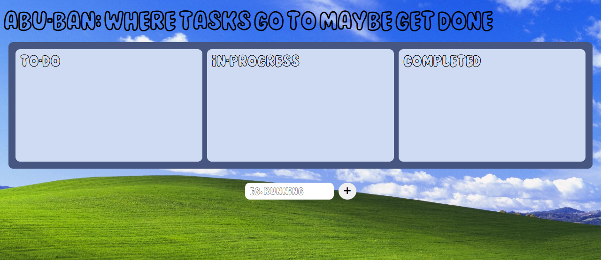

# Abu-Ban: Kanban Task Board

Abu-Ban is a simple Kanban-style task management board built with React and TypeScript. It allows users to add, move, and remove tasks across different stages: To-Do, In-Progress, and Completed. Tasks are saved in localStorage, so progress persists across sessions.

## Features

- Add tasks with a simple input field.
- Drag and drop tasks between columns: To-Do, In-Progress, Completed.
- Remove tasks with a single click.
- Persistent storage using localStorage.
- Automatically generates unique IDs for each task.

## Demo

## Installation

1. Clone the repository:
git clone https://github.com/YOUR_USERNAME/Abu-s-Kanban-Board.git
cd Abu-s-Kanban-Board

2. Install dependencies:
npm install

3. Start the development server:
npm run dev

4. Open your browser at http://localhost:5173 to see the app.

## Usage

- Add a task: Type in the input field and press Enter or click +.
- Move a task: Drag a task card to another column.
- Delete a task: Click the ⌦ button on a task card.
- Tasks are automatically saved to your browser.

## Technologies Used

- React – Frontend library
- TypeScript – Type safety
- SCSS – Styling
- localStorage – Client-side persistence
- Vite – Development and build tool

## Project Structure

src/
├─ assets/          # Images (background, icons)
├─ components/
│  └─ Board.tsx     # Main board component
├─ index.scss        # Global styles
└─ App.tsx           # Root component

## License

This project is open-source and free to use.

## Notes

- Works best on modern browsers.
- Drag-and-drop functionality may vary slightly on mobile devices.
